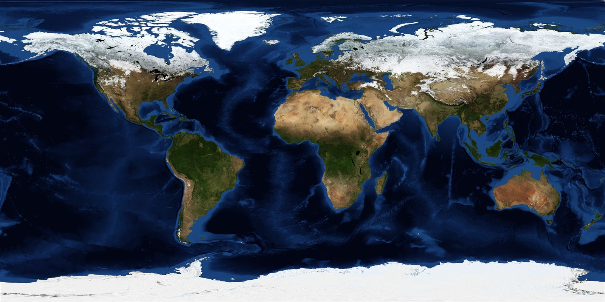

# Agent handover: GAJRA Earth build notes

Workshop document for whichever model or person works on this repo next. Not site copy.
House rules that bind everything here: Australian English, no em dashes anywhere, honesty
chips (Record / Proposal / Invitation / Archive) never mixed, all assets self-hosted, no
CDNs or external fonts, real imagery only (NASA public domain is the vault), the site must
stay readable with JavaScript off.

## Lint before pushing

`python tools/lint.py` is the style guide made executable: em dashes,
intensifiers, US spelling, cross-project vocabulary, inline sizes, broken
links, unbalanced markup, stylesheet version drift. Failures block, warnings
(absolutes, antithesis density) are for a human to judge. CLAUDE.md at the
repo root carries the voice and scope rules into every future session.

## House style

[STYLE-GUIDE.md](STYLE-GUIDE.md) is the type scale, the three typefaces and
what each is for, the colour tokens, the copy rules and the cache-busting
convention. Read it before touching CSS. It was written after the site had
already grown 26 font sizes, so a new size wants a reason before it goes in.

## Reviewing copy without typing much

`python tools/lines.py <page>` numbers every sentence on a page, headings
marked `##`. Say "kill 14, reword 31 and 32" and the numbers are unambiguous.
Numbers are positional, so re-run after edits before quoting them again.

## Repo situation

- This repo (`gajra-earth-claude-build`) is the Claude-built concept site.
- `GAJRA-earth-infinity` is the ChatGPT/Sol-built rival. Borrowing code either way is
  encouraged, with attribution in the commit message. It is compete-to-combine, not
  compete-to-win. The end site for gajra.earth is not yet decided.
- The original `GAJRA-earth` repo is a separate entity. Never build in it.

## The Earth map engine (assets/earth-map.js)

The hard part is done and verified. Zero dependencies, two views, one texture.

- `assets/earth-4096.jpg` is NASA Blue Marble (December 2004, topo + bathymetry),
  public domain, resized to 4096x2048 (power of two, required for WebGL mipmaps).
  `assets/earth-1600.jpg` is the small poster for noscript fallbacks.
- Globe view: raw WebGL sphere (48 stacks x 96 slices), drag with inertia, wheel and
  pinch zoom, slow idle auto-rotation, auroral fresnel rim in the fragment shader.
  All of it honours `prefers-reduced-motion` (no autorotate, no inertia).
- Flat view: the same texture drawn cover-fit on a 2D canvas with pan and zoom.
- Pins are DOM `<button>` elements positioned each frame, so they are keyboard
  focusable and screen-reader labelled for free. Far-side pins get class `away`.
- No WebGL, lost context, or old browser: it silently becomes flat-only.
- Embed recipe, any page:

      

        <noscript>

</noscript>
      

      

- Data file shape (see `data/groups.json`): `{ "groups": [ { name, kind, label,
  lat, lon, place, note, url } ] }`. `label` is one of the four honesty chips,
  lowercase. Coordinates are town or island scale, never addresses.
- Per-page rollout the plan calls for: festivals that sign on, working group general
  locations, AI labs signed on, data centres, grant and tender labs. Each gets its own
  small JSON file in `data/`, same schema, one embed line. Do not invent entries:
  every pin must trace to a signature or a public record.
- `window.__earthMaps` exposes instances for testing. Verify a change with:
  `__earthMaps[0].renderGlobe()` then `gl.readPixels` in the same task (the drawing
  buffer is not preserved across tasks, a zero read outside the frame is normal).
- Idle behaviour: any deliberate move calls `markTouched()`, which stops the drift
  and arms a 30 second timer (`IDLE_RESUME`); when it fires the globe starts
  turning again. `reset()` returns to home longitude, latitude, distance and zoom,
  clears the timer and resumes the drift immediately. Do not set `touched` directly
  anywhere except inside `markTouched`, or the map will freeze permanently again.
- Known deliberate limits (fine to extend, in order of value): no pin clustering
  (irrelevant until there are dozens of pins); the globe does not wrap its
  latitude clamp at the poles by design.

### Map neutrality rules (non-negotiable)

Aerial photography only. No political borders, ever, in any view or any future layer.
No OpenStreetMap default tiles or any styled basemap. If higher resolution is ever
needed, NASA GIBS WMTS serves borderless satellite layers, public domain, no API key;
self-host whatever is used. "Every border a bridge."

## Sign-on packet flow (BUILT, browser side live)

`assets/signon.js` is done and verified. The composer builds the packet in the
browser and hands it to the person's own mail app; there is no endpoint, no
storage, no analytics, and sending it yourself is what makes it consent. Email
is live because the address is real. SMS and WhatsApp are wired but labelled
Proposal, because no number has been published: fill in the recipient in
`smsHref` and the WhatsApp link when one exists. The form refuses to let a
system past without naming its operator, and the generated table row matches
both `SIGNATORIES.md` shapes exactly (the Systems table has the extra Operator
column).

`worker/signon-worker.js` is the server side: written, unit-tested, **not
deployed**. It opens a pull request and never merges, refuses to geocode (map
entries land with null coordinates and a note demanding they be placed by hand),
and strips pipe characters so a packet cannot forge extra markdown table cells.
See `worker/README.md` for the deploy steps and the token scope.

Original design notes, kept because they explain the why:

1. The sign-on page offers three prefilled channels: a `mailto:` link, an SMS body,
   and a WhatsApp `wa.me` link. Each contains the same compact packet, one line of
   JSON the page composes from a small form (name, kind, general place, optional URL,
   consent sentence). The person sends it themselves, so consent is the act of sending.
2. A Cloudflare Worker receives it (email via Email Routing, SMS/WhatsApp via a
   webhook from the chosen provider). The Worker validates shape only: field
   allowlist, length caps, lat/lon sanity, no URLs in free text. Nothing executes.
3. The Worker holds packets in KV as an ephemeral queue and, on approval, opens a
   pull request against `data/groups.json` and `SIGNATORIES.md` via the GitHub API
   (a fine-grained token scoped to this repo only, stored as a Worker secret).
4. Luke merges. Merged means signed, merged means on the map. The PR is the audit
   trail and the vetting gate; nothing lands without a human.
5. Rate limiting: KV counter per sender hash per day. Removal: same channels, the
   word REMOVE plus the name; removal PRs are honoured without process, as the
   licence page already promises.

Privacy lines that must survive any implementation: general locations only, the
packet is exactly what the person typed, no analytics, sender contact details go in
the PR body (private to maintainers) and never into the public JSON.

## The field kit page that is not built yet (design note)

The public help desk material was cut from `asking.html` on 2026-07-28: what to
bring, the market stall pattern, shade and chairs, helping with forms and phones,
the two-chairs-same-side detail. It is a genuinely different activity from asking
somebody three questions, and carrying both made that page twice as long as it
needed to be and confusing about what it was for.

If it comes back it should be its own page. The range section on `asking.html`
ends by saying bigger versions exist and need their own kit, which is the natural
place to link it from. The cut material is in git history if it is wanted verbatim;
the last commit containing it is the one before this note was added.

## Asking and support (BUILT)

`asking.html` is the listening station pattern, labelled Proposal because
nobody has run one. Its point: the definition column in `SIGNATORIES.md` is
supposed to be filled by the people who have to live inside the three words, and
a listening station is where that actually happens. `assets/fieldkit.js` is the
intake tool, built for a phone at a table with no signal: lines are held in
`localStorage` on that device only, anonymous entries need no name, named
entries refuse to save without one, and Clear genuinely clears.

`support.html` is the cherry-pick from `global-founder-atlas`: fifteen real
funders of alignment work, public-interest technology and AI for good, framed
for signatories rather than for this project. Every claim of relationship is
explicitly denied on the page, because none exists. The `.fold` pattern
(jargon behind a `
` so the plain-English reading never breaks) is
borrowed from `straddie-digital-twin-explainer` and is reusable anywhere.

## The daily watch (automated)

A scheduled task, `gajra-ai-governance-watch`, runs every morning at 7am Brisbane
time and publishes to **`watch.html`**, a real public page rather than a data file.
It inserts a new dated `<section>` immediately after the `<!-- WATCH:INSERT -->`
marker so newest is always first, then commits and pushes. Git history is the
archive, and the task trims the page to 30 days.

Scope: AI governance and law, data centres, alignment as a public conversation,
and civil society shaping decisions, prioritising multilateral and regional bodies
over company announcements. It tags items bearing on Q9 and Q10.

**The defence exclusion is deliberate.** No NATO, no defence treaties, no AUKUS
defence pillars, no autonomous weapons, no intelligence programmes. Luke's reason:
this project does not attempt to bridge into that domain and civilian voices are
routinely ignored there anyway. The task reports what it excluded so the call can
be checked. Do not relax this without asking him.

## Before the domain is repointed

`https://gajra.earth` is still serving the original hand-built WordPress site.
It disappears the moment the domain is pointed at this repo or the Codex variant.

**Take a fresh Internet Archive capture of it first** (web.archive.org "Save Page
Now", every page not just the front) so the final state is preserved on purpose
rather than by whatever the crawler happened to catch. The archive page tells
readers the captures are the remaining record, and that should be true rather
than hopeful.

## Remaining backlog

- Per-page map data files: festivals, working groups, AI labs, data centres,
  grant and tender labs. Each is a small JSON in `data/` plus one embed line.
  Never invent an entry; every pin traces to a signature or a public record.
- `straddie-digital-twin-explainer` has a git remote configured but **does not
  exist on GitHub**, so it is local-only. Worth telling Luke before relying on
  any link to it.
- The twin explainer's governing rule is worth adopting here verbatim: "If a
  sentence here ever reads bigger than its label, the label wins."
- Model economics: routine passes (copy, embeds, new data files, nav edits) belong
  on Sonnet. Save the heavy model for genuinely hard engine or architecture work.

## Verification habit before any push

Statics: every page 200 on `npx serve`, zero em dashes outside `archive/`
(`grep -rn $'—' --include='*.html' --include='*.md' --include='*.js' . | grep -v archive/`),
heading order valid. Dynamics: console clean on index and map, `__earthMaps` pixel
checks, ticker animating, film playing. The launch config is `gajra`, port 4201.
